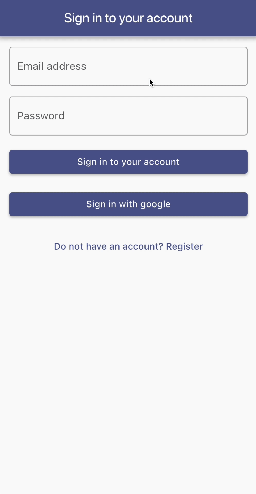
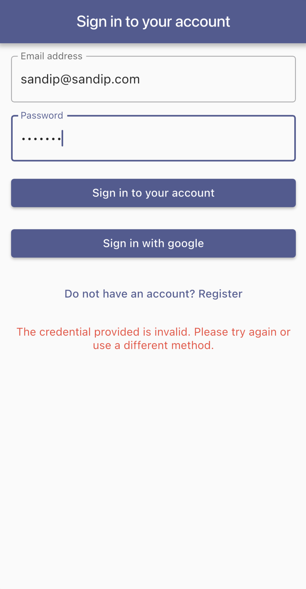

# Firebase Login

Example flutter app built with Riverpod that demonstrates authentication with Firebase.

## Features

- Sign up with Email and Password
- Sign in with Email and Password
- Sign in with Google
- Error handling

## Getting Started

1. Generate the native folders first by running `flutter create --platforms=android,ios,web,windows,macos .`
2. Create your firebase project, and enable email/password authentication and google.
3. Use [FlutterFire CLI](https://firebase.google.com/docs/flutter/setup?platform=ios) to connect the app with the firebase project.
4. Run the app.
