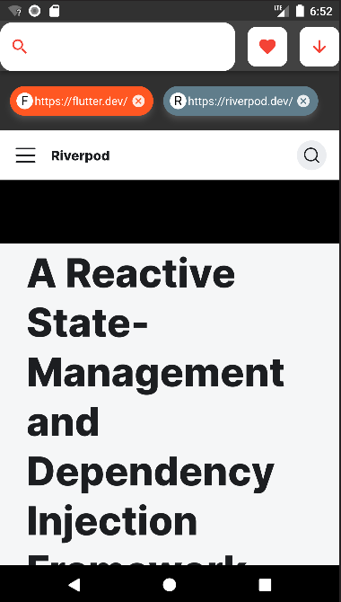

A Flutter app that displays simple browser using riverpod state management

# Goal of this example

This Simple Browser App demonstrates how to:

- search web pages via the search bar
- add a website to the favorites
- open a page from the favorites
- hide or show a favorites page list

This app uses two approaches. First approach is with Provider which accesses the data from the state. 
The next one is StateNotifier which manages state with new or edited data. For example when the user 
clicks on the favorite button, StateNotifier is used for adding web page to the state list. 
StateNotifier is also used when user wants to remove the web page from the favorites list, 
after which it updates the state. Before that can be done, Provider is used to check current 
web page and all pages in favorite list. If the page exists inside favorites list, user is able to 
remove the web page from the list. If web page is not located in the favorites list, 
user can add web page to it.

This Simple Browser App is a good example for how to use StateNotifier and Provider together. 
StateNotifer is used when the user clicks or writes something in the input place and Provider 
is used when the user wants to read some information.

Initial page             |  Show favorites pages          |  Search web page
:-------------------------:|:-------------------------: |:-------------------------:
  |    |  
