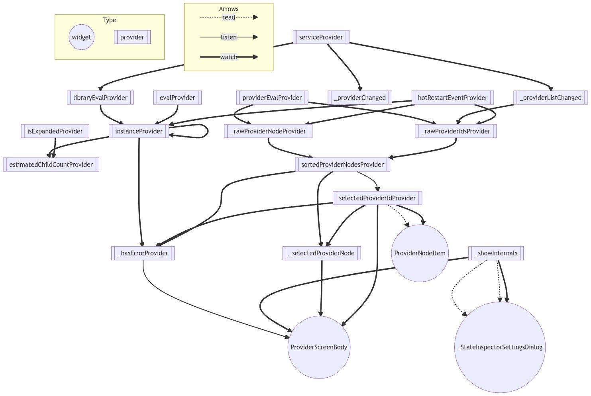

**Work in progress**

This project is a work-in-progress command that analyzes a Riverpod project and
generates a graph of the interactions between providers/widgets

## Example
Graphs can be generated using [d2](https://d2lang.com/) or [Mermaid](https://mermaid-js.github.io/mermaid/#/) text-to-graph syntax.

Here is graph example, generated from the Flutter Devtool project (which uses Riverpod).



## Generating a graph

Assuming you are working on `riverpod_graph` in this repo.  You can test against other projects with relative references. Generating a graph against the `examples/todos` project would look like:

```
cd <the riverpod_graph directory>
```

mermaid.js markup
```bash
dart run riverpod_graph path/to/folder
```

d2 markup
```bash
dart run riverpod_graph path/to/folder -f d2
```

Assuming you have activated, installed, riverpod_graph in the global dart cache:

mermaid.js markup
```bash
cd <the lib directory of the program you wish to analyze>
$ dart pub global run riverpod_graph .
```